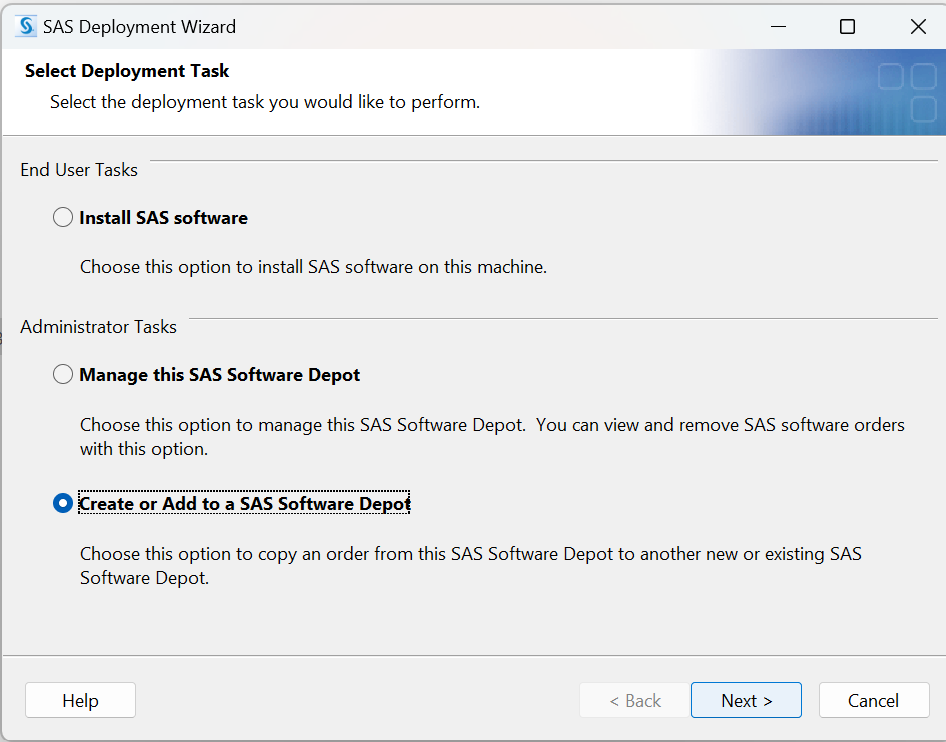
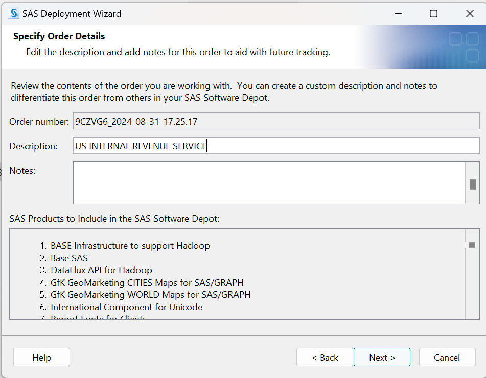
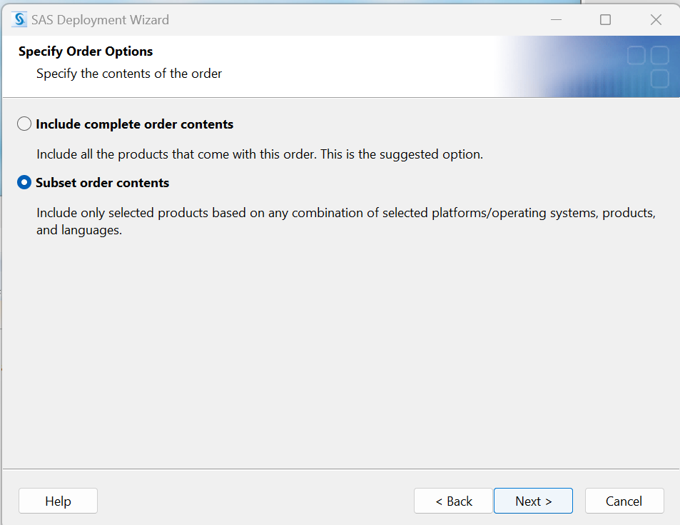
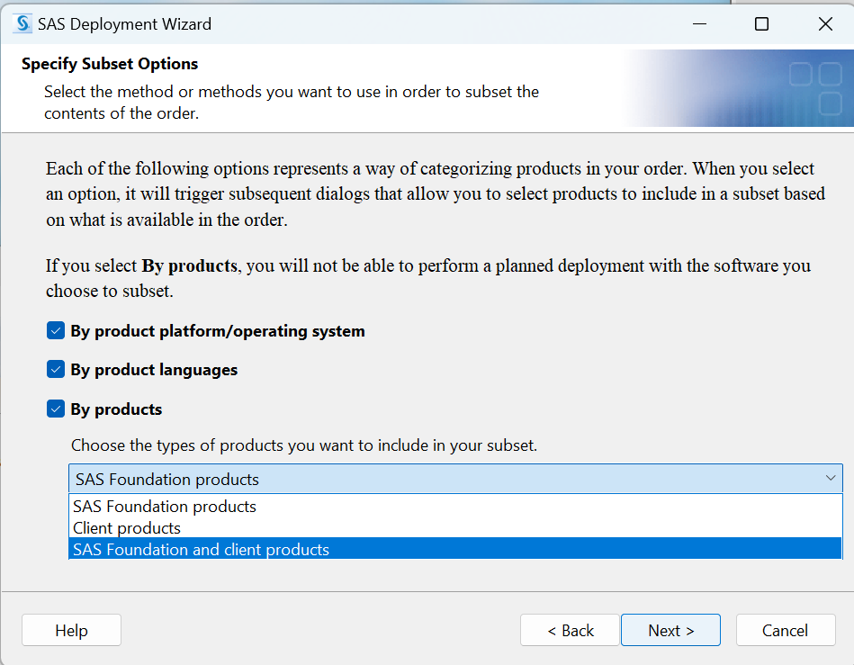
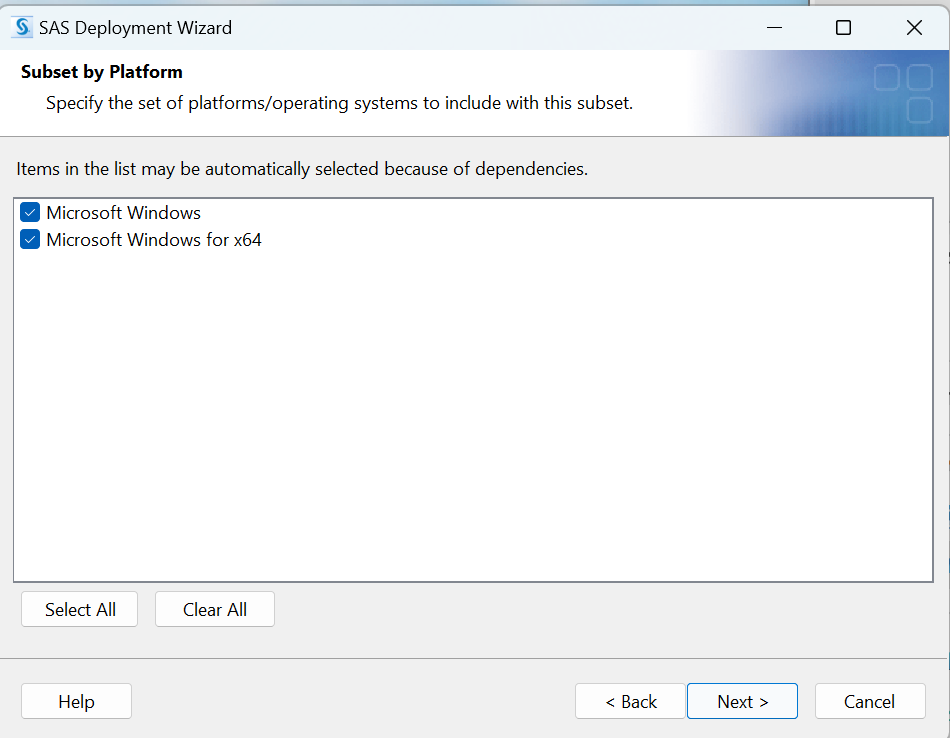
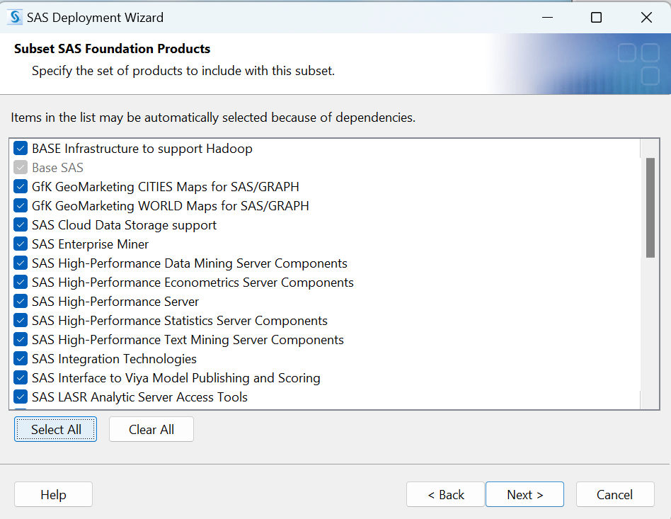
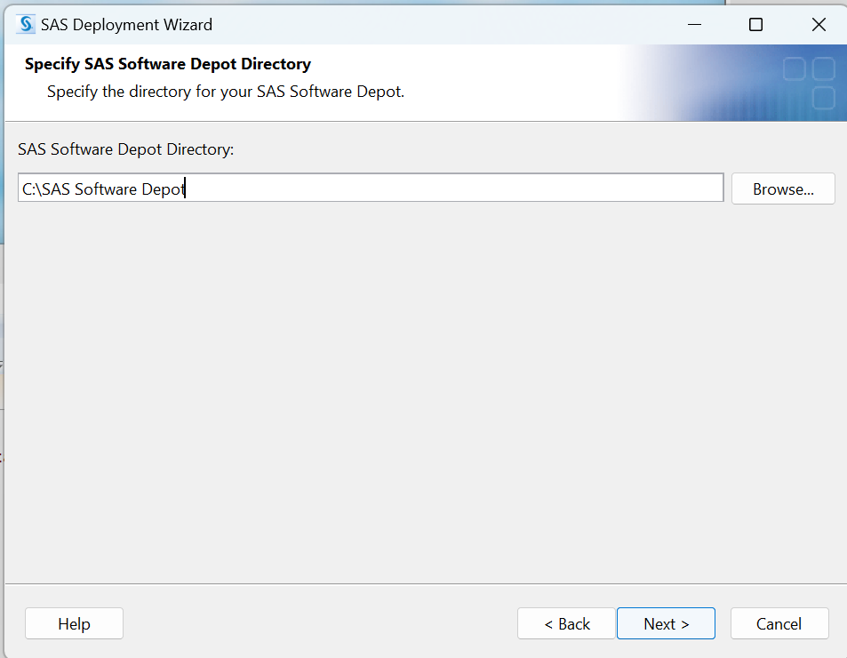

# Create a SAS Depot Subset 

Converting between Depots

    

I think we can make notes in the description of the depot  

               

Subset the order contents          

                              

If we choose only SAS Foundation, we get only BASE SAS. If we choose Client products, we won't get BASE SAS.

                   

Windows

                           

Select all the SAS Foundation products, because I am not sure which ones are important. 

      

this will choose the location of the new SAS Depot

  