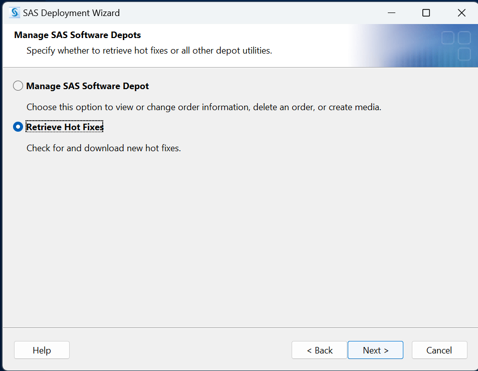
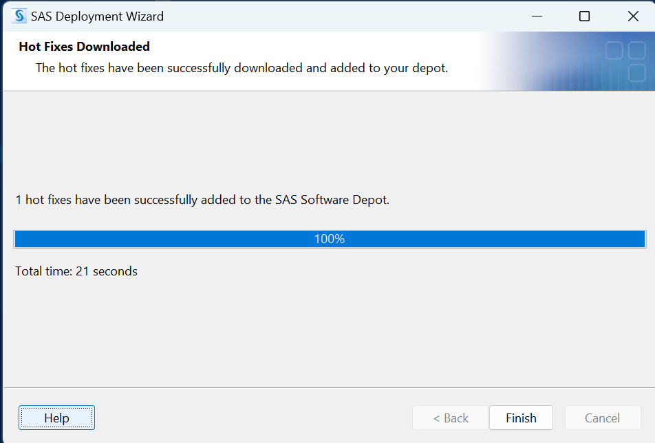

# Introduction  
SAS releases hotfixes to address security needs.  Unlike Windows or Microsoft Office, there is no monolithic installer or updater. We go back to the original SAS Depot and run 

# Overview 
The SAS Deployment Wizard will reach out to SAS to pull down the hotfixes according to the files list already in the SAS Depot.

Startup the SAS Deployment Manager

Retrieve the Hot Fixes

The Downloaded Files will be provided to the the existing SAS Depot

