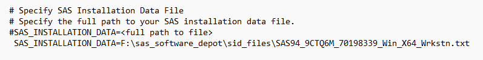

# Table of Contents
- [Table of Contents](#table-of-contents)
- [Introduction](#introduction)
- [Use of this Document and Git Repo](#use-of-this-document-and-git-repo)
- [Remove Old SAS Client Install](#remove-old-sas-client-install)
- [Installation](#installation)
- [Common Installation Issues](#common-installation-issues)

What the project does
Why the project is useful
How users can get started with the project
Where users can get help with your project
Who maintains and contributes to the project

# Introduction

SAS will be deployed by UNS using the Altiris installer. Basically, we download the entire SAS Depot of installation software, and then run the installer paired with a data file called a responsefile.  We will also change the specific responsefile to including a path to a license file.

The start.exe file can be called using either 

 Since we are working with files in "c:\Program Files", PowerShell should be started with Admin privileges. 


User settings are stored in a *user's* profile and will not be destroyed by either uninstallation or installation. However, these files can be copied somewhere safe before installation and periodically. 

```
c:\users\<<SEID>>\AppData\*\SAS
```

# Use of this Document and Git Repo

The targeted response files is the only 

# Remove Old SAS Client Install

Because we are using automation to deploy the new entire SAS client (9.4M8), not upgrading all of the pieces, we need to delete any installed pieces from the client workstation.

Previously, installers with admin privileges could install a feature named SAS PC Files Server as a service.  This wasn't a part of the standard install and won't be part of the install in the future.  However, the service's presence will prevent a clean removal.

```
Stop-Service -Name 'SAS PC Files Server'  
```

Any future install will look to the *installer's* Windows profile for a record of the previous installation. The installation logs and records are stored in a folder named SASDeploymentWizard. Therefore, we will destroy any SASDeploymentWizard folders we can find.  During installation, monitor this directory.

```
Remove-Item -Recurse -Force -Path C:\Users\*\AppData\Local\SAS\SASDeploymentWizard

reg delete "HKLM\SOFTWARE\SAS Institute Inc." /f 

Remove-Item -Recurse -Force -Path 'C:\Program Files*\SASHome'
```


# Installation
Troubleshooting:  You can use a reponsefile to automate the install process and standardize the installation.  ResponseFile REQUIRES an entry with a full path to a license file.  The license files are stored at the root of \sas_software_depot\sid_files, and they will be called 

Three locations need to be declared when runnning the script: 
  1. The full path to the Software Depot's Root. The root contains setup.exe 

    During development, we saved the sas_software_depot to the users desktop:
    "C:\Users\<seid>\Desktop\sas_software_depot"
  
  2. The location of the response files that are included in this repository or saved elsewhere:
  
    "C:\Users\<seid>\OneDrive\Documents\sas_workstation_install_config\ResponseFiles\ResponseFile-Basic-EG64.txt"  
    or  
    "C:\Users\<seid>\OneDrive\Documents\sas_workstation_install_config\ResponseFiles\ResponseFile-Extended-EG64.txt"  
     
  
  3. The full path to the license file (by default, within the SAS Depot's sid_file directory).  The responsefile found in Step 2, should be modified to include the path to SAS94_9CTQ6M_70198339_Win_X64_Wrkstn.txt.  




The setup command will require a full path to a responsefile.  We will choose among two: 
```
- ResponseFile-Basic-EG64.txt
- ResponseFile-Extended-EG64.txt

"C:\Users\<seid>\OneDrive\Documents\sas_workstation_install_config\ResponseFiles\ResponseFile-Basic-EG64.txt"
"C:\Users\<seid>\OneDrive\Documents\sas_workstation_install_config\ResponseFiles\ResponseFile-Extended-EG64.txt"

'# $ResponseFile = "C:\Users\<seid>\OneDrive\Documents\sas_workstation_install_config\ResponseFiles\ResponseFile-Basic-EG64.txt"
'# $ResponseFile = "C:\Users\<seid>\OneDrive\Documents\sas_workstation_install_config\ResponseFiles\ResponseFile-Extended-EG64.txt"
```
The command can either be installed with the user dialogs or without (quiet).
```
C:\sas_software_depot\setup.exe -RESPONSEFILE $ResponseFile # -quiet

```
Start-Process -filepath "c:\sas_software_depot\setup.exe" -ArgumentList '-RESPONSEFILE $ResponseFile'
```
 msiexec.exe /i "F:\sas_software_depot\products\eguide__94200__wx6__en__sp0__1\eguide.msi" /qn /norestart DIR_APPFILES="C:\Program Files\SASHome\SASEnterpriseGuide\8" REG_FILETYPES="0" ARPSYSTEMCOMPONENT=1 REINSTALLMODE=amus /LV*X "F:\sas_software_depot\enterprise_guide_log.txt"
```


# Common Installation Issues

If any installation problems are encountered, then the deployment history is located in  C:\Users\<<SEIDad>>\AppData\Local\SAS\SASDeploymentWizard contents should be zipped and submitted to the CDWHelpDesk.

* Check for log entry c:\users<<siedad>>\AppData\Local\SAS\SASDeploymentWizard\SDW_YEAR_<datetime>.log reporting that the response file is invalid.  [MODIFY the ResponseFile](#installation) to point to an accurate location of SAS94_9CTQ6M_70198339_Win_X64_Wrkstn.txt

* Starting the install by doubleclicking on the Start.exe file will launch the Install Dialogs, but decisions will need to be made at each step.
